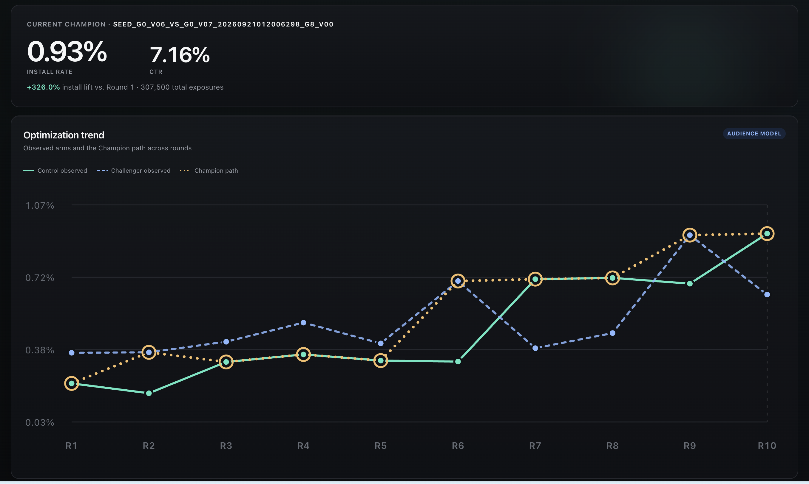
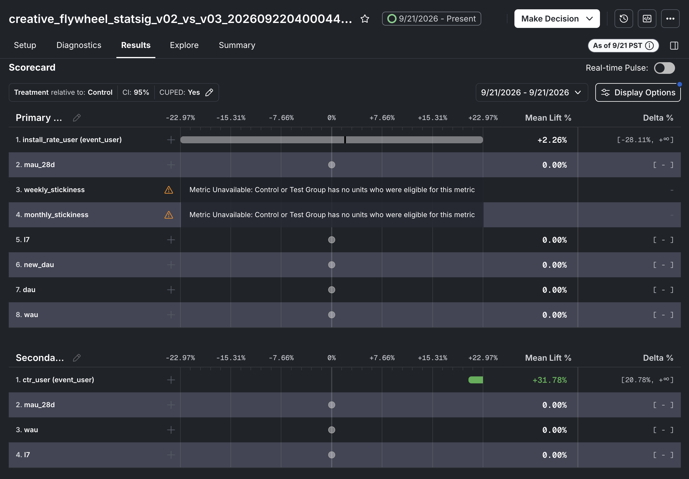

# Creative Flywheel

Creative Flywheel runs a complete local creative-optimization loop: it compares
two seed ads, simulates audience responses, uses an OpenAI model to propose each
new challenger, renders the videos, and shows the completed trajectory in a
local dashboard.

The dashboard summarizes the current champion and shows how install rate changes
across optimization rounds:



## Deliverables

- **Code:** [renderer](src/video.tsx),
[audience model](src/audience/model.ts),
[Statsig integration](src/experiment/statsig.ts), and
[agent orchestrator](src/agent/orchestrator.ts). See the
[single-command local workflow](#run-the-end-to-end-test-locally).
- **Report**: [Report:](REPORT.md#4-agent-loop) How this works and why design like that? Limitation and next steps
- **Experiments:** [Statsig exposure stream](public/statsig-exposure-stream.png)
and [v2 vs. v3 results](public/statsig-v02-vs-v03-results.png).
- **Creatives:** [current champion video](artifacts/runs/seed_g0_v06_vs_g0_v07_20260921012006298/creatives/seed_g0_v06_vs_g0_v07_20260921012006298_g8_v00/video.mp4),
[generation-zero manifests](manifests/), and the [render pipeline](src/video.tsx).
Each local run writes the generation-zero and final-generation videos and
manifests to `artifacts/runs/`; use the [dashboard](#open-the-dashboard) to
review them.
- **Trajectory:** the [dashboard](#open-the-dashboard),
[portable trajectory model](src/agent/trajectory.ts)
- **Recording:** the 13-minute walkthrough is [here](https://drive.google.com/file/d/1xHkAf_6buwDD0y3u3jHWejWG1V3-d_3M/view?usp=sharing); the external upload link is pending. See the [productionization sketch](REPORT.md#5-productionization) and
[next steps](REPORT.md#next-steps).


## Set up the environment

Install [Bun](https://bun.sh/) 1.3.14, then install the project dependencies:

```bash
bun install --frozen-lockfile
```

Create a `.env` file in the project root:

```dotenv
OPENAI_API_KEY=your-api-key
OPENAI_MODEL=gpt-5.6-luna
```

The local end-to-end workflow does not require Statsig credentials. The API key
is used only when the agent proposes the next challenger. Each round also renders
its creatives locally; the first render downloads Remotion's pinned Chrome
Headless Shell.

## Open the dashboard

Start the dashboard to explore completed optimization runs:

```bash
bun run dashboard
```

Then open [http://localhost:3000](http://localhost:3000). The dashboard reads
runs from `artifacts/runs/` and shows each round's creatives, experiment result,
agent learning, next hypothesis, and creative lineage. Select a run from the
menu to switch between trajectories.

Set `DASHBOARD_PORT` to use a different port:

```bash
DASHBOARD_PORT=4000 bun run dashboard
```

## Statsig integration status

The Statsig integration now supports experiment creation, SDK assignment, event logging, and result retrieval through the Console API. Now, click-through rate (CTR) and install-rate results became available the following day. 

The next step is to run a persistent agent that waits for published results,
periodically checks Statsig, and resumes evaluation when the evidence is ready.
The existing `bun run agent tick --run-id <id>` command provides one observation and evaluation pass, but a persistent runner still needs to schedule these checks



## Run the end-to-end test locally

```bash
bun run agent run \
  --seed-control g0_v00 \
  --seed-treatment g0_v01 \
  --max-rounds 10 \
  --verbose

bun run agent run \
  --seed-control g0_v02 \
  --seed-treatment g0_v03 \
  --max-rounds 10 \
  --verbose

bun run agent run \
  --seed-control g0_v04 \
  --seed-treatment g0_v05 \
  --max-rounds 10 \
  --verbose

bun run agent run \
  --seed-control g0_v06 \
  --seed-treatment g0_v07 \
  --max-rounds 10 \
  --verbose
```

The eight generation-zero manifests are divided into four seed pairs. Each
command runs ten optimization rounds, writes a separate run to `artifacts/runs/`,
starts the local dashboard, and opens the completed run in your browser.
