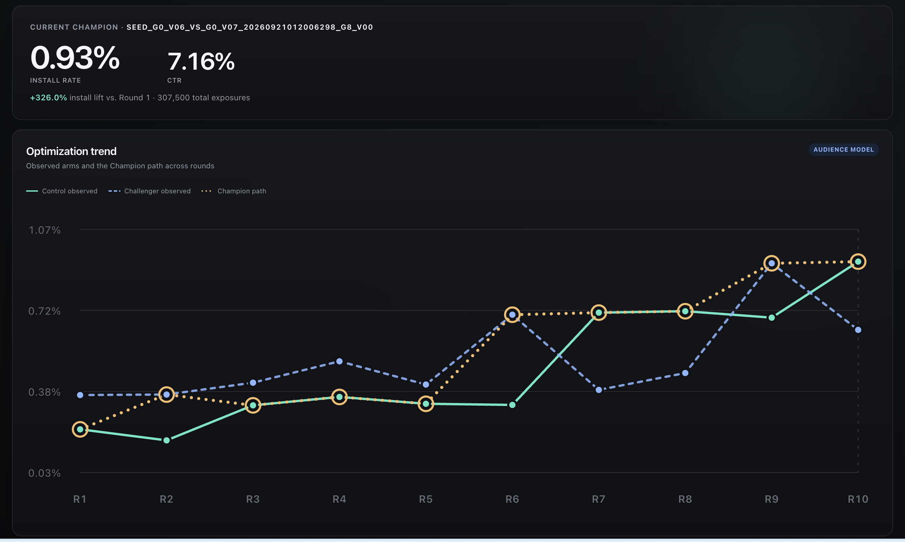
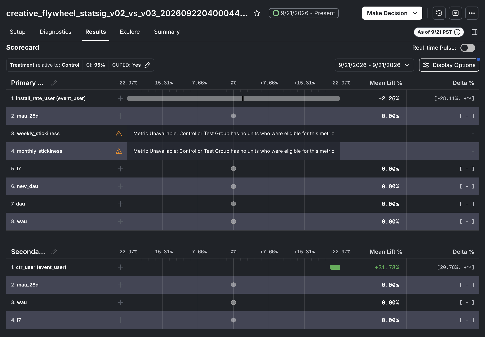

# Creative Flywheel

Creative Flywheel runs a complete local creative-optimization loop: it compares
two seed ads, simulates audience responses, uses an OpenAI model to propose each
new challenger, renders the videos, and shows the completed trajectory in a
local dashboard.

The dashboard summarizes the current champion and shows how install rate changes
across optimization rounds:



## Deliverables

- **Code:** [renderer](src/video.tsx),
[audience model](src/audience/model.ts),
[Statsig integration](src/experiment/statsig.ts), and
[agent orchestrator](src/agent/orchestrator.ts). See the
[single-command local workflow](#run-the-end-to-end-test-locally).
- **Report**: [Report:](REPORT.md#4-agent-loop) How this works and why design like that? Limitation and next steps
- **Experiments:** [Statsig exposure stream](public/statsig-exposure-stream.png)
and [v2 vs. v3 results](public/statsig-v02-vs-v03-results.png).
- **Creatives:** [current champion video](artifacts/runs/seed_g0_v06_vs_g0_v07_20260921012006298/creatives/seed_g0_v06_vs_g0_v07_20260921012006298_g8_v00/video.mp4),
[generation-zero manifests](manifests/), and the [render pipeline](src/video.tsx).
Each local run writes the generation-zero and final-generation videos and
manifests to `artifacts/runs/`; use the [dashboard](#open-the-dashboard) to
review them.
- **Trajectory:** the [dashboard](#open-the-dashboard),
[portable trajectory model](src/agent/trajectory.ts)
- **Recording:** the 13-minute walkthrough is [here](https://drive.google.com/file/d/1xHkAf_6buwDD0y3u3jHWejWG1V3-d_3M/view?usp=sharing); the external upload link is pending. See the [productionization sketch](REPORT.md#5-productionization) and
[next steps](REPORT.md#next-steps).


## Set up the environment

Install [Bun](https://bun.sh/) 1.3.14, then install the project dependencies:

```bash
bun install --frozen-lockfile
```

Create a `.env` file in the project root:

```dotenv
OPENAI_API_KEY=your-api-key
OPENAI_MODEL=gpt-5.6-luna
```

The local end-to-end workflow does not require Statsig credentials. The API key
is used only when the agent proposes the next challenger. Each round also renders
its creatives locally; the first render downloads Remotion's pinned Chrome
Headless Shell.

## Open the dashboard

Start the dashboard to explore completed optimization runs:

```bash
bun run dashboard
```

Then open [http://localhost:3000](http://localhost:3000). The dashboard reads
runs from `artifacts/runs/` and shows each round's creatives, experiment result,
agent learning, next hypothesis, and creative lineage. Select a run from the
menu to switch between trajectories.

Set `DASHBOARD_PORT` to use a different port:

```bash
DASHBOARD_PORT=4000 bun run dashboard
```

## Statsig integration status

The Statsig integration now supports experiment creation, SDK assignment, event logging, and result retrieval through the Console API. Now, click-through rate (CTR) and install-rate results became available the following day. 

The Temporal observer now durably waits for published results and resumes the
existing agent evaluation when the evidence is eligible. It closes the loop from
Statsig results to a persisted decision proposal, not automatic deployment of the
next experiment. The manual `bun run agent tick --run-id <id>` command remains
available for a single observation pass.



### Run the durable observer

Requires Node.js 22.16+ alongside Bun, a Temporal server, and the Statsig/OpenAI
settings in [.env.example](.env.example). The Temporal Worker runs on Node; its
Activity invokes the existing Bun CLI because the ledger uses `bun:sqlite`.
Credentials stay in the Worker environment, not Workflow arguments.

For local development, install the [Temporal CLI](https://docs.temporal.io/cli)
and start a server with a persistent database:

```bash
mkdir -p .cache
temporal server start-dev --db-filename .cache/temporal.db
```

In another terminal, start the Worker from the project root:

```bash
bun run durable worker
```

Register an already-served Statsig run, then inspect it:

```bash
bun run durable start --run-id <run-id>
bun run durable status --run-id <run-id>
```

Each run has one stable Workflow ID. The first check runs immediately; subsequent
checks use durable one-hour timers (`--poll-seconds` overrides this at start).
Missing results or insufficient exposures keep waiting without invoking the
model. Once eligibility passes, the existing agent writes a proposal to the
ledger and the Workflow completes with its ID. Repeated starts do not duplicate
a running or completed Workflow; retries recover an already-persisted proposal.
Activities are at-least-once: a crash before persisting a proposal can repeat a
model call, so this is not an exactly-once model invocation guarantee.

Timers and Workflow history survive Worker restarts. No agent process or model
call runs while the Workflow waits. Detection latency is up to the polling
interval, plus service/Worker delays; this does not make Statsig publication
real-time. Request an immediate check or stop watching with:

```bash
bun run durable check --run-id <run-id>
bun run durable cancel --run-id <run-id>
bun run agent proposals --status pending
```

Unserved runs and blocked evidence wait for manual correction followed by
`check`. The observer never resends events. Transient Activity failures retry up
to five attempts with backoff; Statsig authorization failures stop immediately.
After fixing a failed Workflow, `start` may create a new execution with the same
ID. A completed proposal still needs human review; provider-side execution of
approved proposals is not implemented yet.

**Deployment boundary:** this first integration supports one Worker process,
with one active observation Activity at a time, on the host holding the run
artifacts and SQLite ledger. Keep both on persistent storage. For a hosted
Temporal service, configure `TEMPORAL_ADDRESS`, `TEMPORAL_NAMESPACE`, and
`TEMPORAL_API_KEY` (TLS); the Worker remains your deployment responsibility.
The local dev server is not a production server. Shared artifact/database
storage, multi-worker concurrency, deployment versioning, and operational alerts
remain prerequisites for a horizontally scaled production rollout.

Verification: `bun run check` runs type checks, existing Bun tests, and Temporal
integration tests. `bun run test:durable` starts an isolated local Temporal server
(the SDK downloads its binary on first use); it needs no provider credentials
and tests timers, retries, signals, Worker restart/replay, and cancellation.

## Run the end-to-end test locally

```bash
bun run agent run \
  --seed-control g0_v00 \
  --seed-treatment g0_v01 \
  --max-rounds 10 \
  --verbose

bun run agent run \
  --seed-control g0_v02 \
  --seed-treatment g0_v03 \
  --max-rounds 10 \
  --verbose

bun run agent run \
  --seed-control g0_v04 \
  --seed-treatment g0_v05 \
  --max-rounds 10 \
  --verbose

bun run agent run \
  --seed-control g0_v06 \
  --seed-treatment g0_v07 \
  --max-rounds 10 \
  --verbose
```

The eight generation-zero manifests are divided into four seed pairs. Each
command runs ten optimization rounds, writes a separate run to `artifacts/runs/`,
starts the local dashboard, and opens the completed run in your browser.
