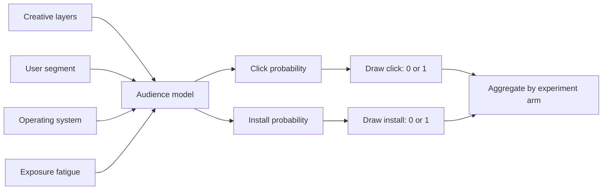
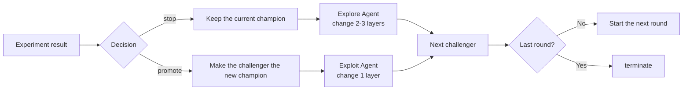
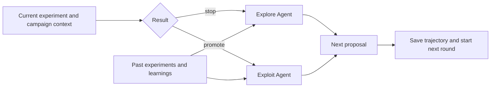

# Creative Flywheel Report

Creative Flywheel is a continuous loop to produce ad creative driven by feedback from  A/B tests. It builds ads from reusable parts, updates the winning variant from experiment results, and asks an Agent to suggest the next challenger. The goal is to improve **installs per impression** and **click-through rate (CTR).**

The current system is intentionally small. It proves the full loop while leaving clear paths for future growth. Open the local dashboard to view the control and challenger videos for each round, statistical decisions, agent's learning, the next-round hypothesis, and the complete creative lineage.

```bash
bun run dashboard
```

Run end to end locally:
```bash
bun run agent run --seed-control g0_v02 --seed-treatment g0_v03 --max-rounds 9 --openai-model gpt-5.6-luna --verbose
```

## 1. Modular creative pipeline

A `CreativeManifest` describes an ad with six layers: background, character, action, hook, call to action (CTA), and audio. Each variant has a unique `variant_id`, a `generation`, and a `parent_id`. These fields show where the variant came from and how it changed over time.

Generation 0 contains eight variants and uses all six layers. The current catalog can create 7,200 possible combinations. Remotion renders each manifest as an 8-second vertical video in a repeatable way. 

- Render one variant:
  ```bash
  bun run experiment prepare --run-id render_demo_001
  bun run render --run-id render_demo_001 manifests/g0_v00.json
  ```
  The video is written to
  `artifacts/runs/render_demo_001/creatives/g0_v00/video.mp4`.
- Render every manifest:
  ```bash
  for manifest in manifests/g0_v*.json; do
    bun run render --run-id render_demo_001 "$manifest"
  done
  ```

The prototype does not use an LLM to create images, copy, audio, or video. This keeps the first version fast and repeatable. A production system that uses video generation models would need extra controls for orchestration.

## 2. Simulated audience

The audience model estimates the chance of a click or install for **one creative and one user context**. The user context includes the user segment, operating system, and exposure fatigue.

The model uses about 120,000 past impression records. Each record includes the creative layers, user context, and click and install labels. The data is split by `user_id`: 80% for training and 20% for validation. Two regularized logistic regression models estimate click and install probability.

For each simulated impression, the model first returns two probabilities. The simulator then draws one random number for click and one for install. If the random number is below the probability, the event is recorded as `1`; otherwise it is `0`.



## 3. Experimentation

Each round is a two-arm experiment between the current champion and one challenger.


| Item             | Current rule                                                                                   |
| ---------------- | ---------------------------------------------------------------------------------------------- |
| Hypothesis       | Defined before the experiment; the challenger is expected to improve install rate over control |
| Arms             | Control is the current champion; treatment is the challenger                                    |
| Traffic          | 50/50 split, with one assignment per user                                                       |
| End point        | Fixed target sample size; the local simulator does not model real waiting time                  |
| Sample size      | Set before the experiment from baseline rate, minimum detectable effect, alpha, and power       |
| Primary metric   | Install rate: installs divided by impressions                                                   |
| Secondary metric | Click-through rate (CTR): clicks divided by impressions                                         |


The sample size is rounded to 500-user batches. At the target sample size, the simulator groups results by arm and calculates install rate, CTR, treatment effect, p-value, and confidence interval.

The decision is made by code, not by the Agent. 

- The system returns `promote` only when the treatment effect on install rate is positive, the p-value is at or below alpha, and the lower bound of the confidence interval is above zero. 
- Otherwise, it returns `stop`. Because this is a fixed-sample experiment, it stops after reaching the target sample size even when the result is not significant.



`stop` and `promote` are decisions for one experiment. `terminate` ends the full optimization run after the final round.

## 4. Agent loop

The first version used one Challenger Agent. It often made small changes near the current champion, even after a loss. The system now uses two roles so that each result leads to a clearer next step.

- After `stop`, the Explore Agent keeps the current champion and changes two or three layers. Its goal is to search a wider area.
- After `promote`, the Exploit Agent starts from the new champion and changes one layer. Its goal is to improve the winner while keeping the result easy to explain.



The Agent has three main boundaries:


| Boundary      | What it contains                                                                                                                                                                                 |
| ------------- | ------------------------------------------------------------------------------------------------------------------------------------------------------------------------------------------------ |
| Input         | The current round, the code-made decision, the champion, both creative manifests, the experiment result, the campaign brief, and the creative catalog                                            |
| History tools | Search past experiments and open the full history of a related optimization run. These tools are read-only.                                                                                      |
| Output        | A structured proposal with a short recap, the main learning, the next hypothesis, the target audience, expected user response, trade-offs, supporting evidence, and the proposed creative layers |


The saved trajectory links results, Agent reasoning, creative changes, and the next experiment. It helps a human understand why the system made a choice. It also helps the Agent avoid repeated ideas and reuse useful lessons from earlier rounds.

The main bottleneck is now hypothesis quality. The system saves evidence, learnings, trade-offs, and the full trajectory, but a human still reviews the quality. The next step is to build an evaluation set from past experiment snapshots and score each proposal for clarity, testability, novelty, and repeated ideas.

## 5. Productionization

This system is different from an Agent that stays alive and remembers a long conversation. A real experiment may wait for days, and some actions may need human review. The Agent should not keep a process open during that time, and its context window should not be used as a database.

The key production problem is durable execution: the workflow must pause, keep its state, and resume later without losing context.

### When does the Agent wake up?

After an experiment starts, the workflow enters a waiting state. A scheduler checks it at set times, or an event from the experiment provider wakes it up. If the sample size is too small, results are not ready, or a health check fails, the system saves the latest observation and schedules another check.

Only when the fixed sample size is reached and the result is ready does code make the experiment decision and wake the Explore or Exploit Agent.

### How does it keep context?

The system does not save a long chat. Each time the Agent wakes up, it rebuilds a short context from stored facts: the current champion, frozen experiment settings, latest result, campaign brief version, creative catalog version, and relevant past trajectories.

These records must be versioned. For example, a new campaign brief must not silently replace the brief used by an older experiment. With this design, an Agent call is short and safe to retry, even after a worker restarts or the workflow waits for several days.

### What can the current prototype reuse?

The current `OptimizationRun`, experiment snapshots, and trajectories already store the main history. A SQLite ledger is being added to store scheduling state, worker leases, approvals, and repeat-safe execution receipts. However, the prototype has not yet proved a real multi-day pause-and-resume flow. The local simulator runs in one process, so it does not fully test durable execution.

The Statsig path shows this gap clearly. After sending an experiment to the provider, the worker should stop. Later, a scheduler should read the stored state, check Statsig again, and continue from the same step. In production, a shared database and task queue can replace SQLite, and object storage can replace local files. The state boundaries and Agent inputs can stay the same.

### Other production questions

1. **Where do renders live?** The prototype stores each render inside its optimization run package. Production should store immutable files in object storage and serve them through a CDN.
2. **How are variants versioned?** A `variant_id` is never reused. Generation, parent, and configuration versions record the creative history. A metadata database stores experiment and release state.
3. **What starts a new round?** A scheduler or provider event detects that the fixed sample size has been reached or results are ready. 
4. **How does a human stay in the loop?** People don't need to review every proposal. People set the campaign goal, brand rules, and safety limits. They review high-risk or flagged proposals. The exact approval rule depends on cost and risk.

## Next steps

1. **Prove a real durable Statsig loop.** Run the same optimization across separate processes: create an experiment, stop the worker, wait for data, and let a scheduler resume the workflow from stored state.
2. **Build Agent evaluation and preview tools.** Turn reviewed trajectories into an evaluation set, score proposal quality, and set up a `preview_creative` tool to let agent preview the proposed video before approval.
3. **Add real interaction data.** Store user exposure and action data so the system can study behavior patterns, creative fatigue, and audience differences to make a bettwe hypothesis
4. **Add guardrails and safety checks.** The provided dataset cannot form a baseline metric, nor can it be simulated. Track negative signals such as skip rate or brand-safety failures. 
5. **Evaluate a valid sequential-testing design.** The current fixed-sample test stops when it reaches its target. If the system needs to continue or stop early, those rules should be defined in statistical code. The Agent should not freely decide this because repeated checks can increase false positives.
