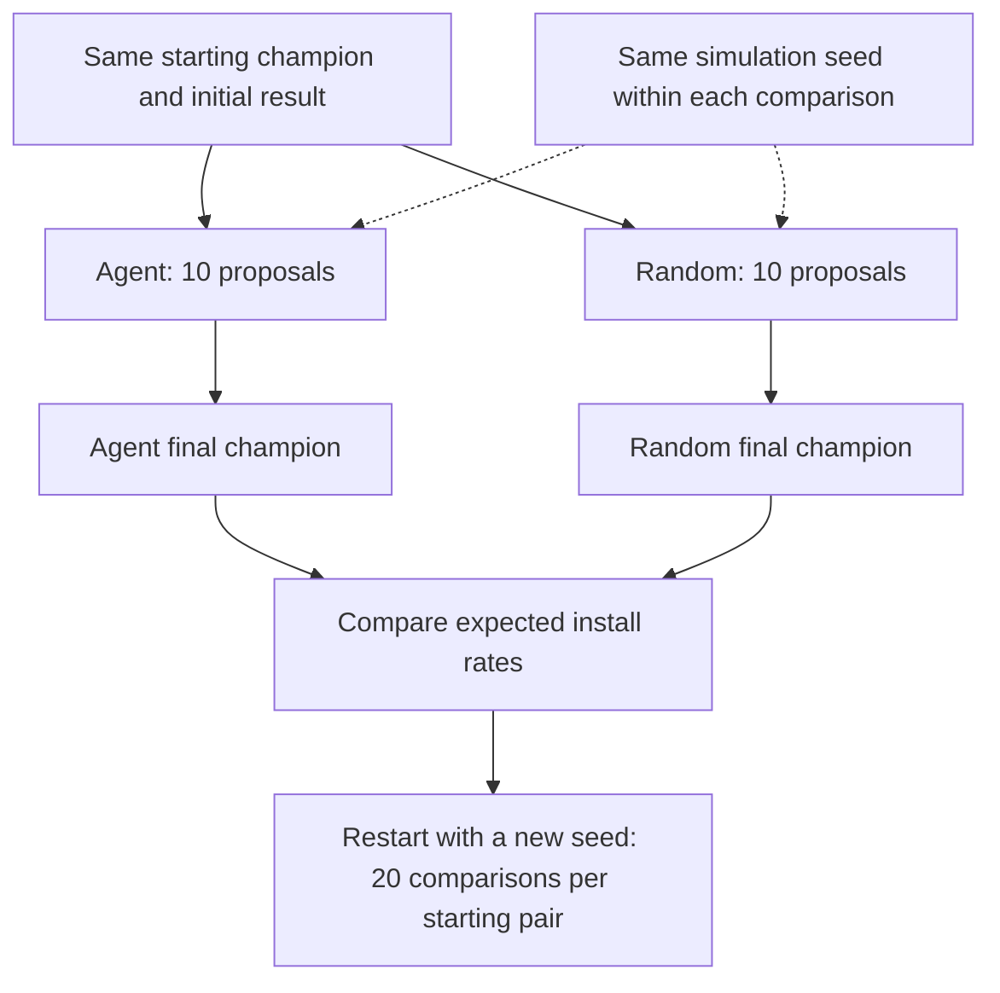
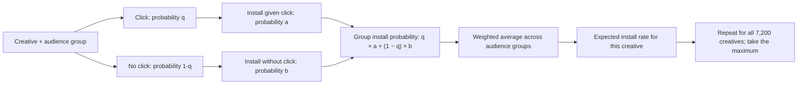

# Agent Evaluation Proposal

## Objective

Find better creatives within a fixed budget, approaching the simulator’s highest expected install rate.

| Capability | Core question |
| --- | --- |
| Evidence Use | Can the Agent find and correctly interpret relevant evidence? |
| **Hypothesis Formation — evaluate first** | Does it choose better creative changes than random selection? |
| Reflection & Adaptation | Does feedback improve its next proposal? |

## Budget and baseline

- **Budget:** ten challenger proposals per strategy per run. Record exposures and model cost separately.
- **Random baseline:** after promotion, change one random layer; otherwise, change two or three with equal probability. Select layers and replacement values uniformly from legal choices.
- Both strategies use the same simulator, promotion rules, and duplicate restrictions.

## Paired comparisons

- Use all four existing starting pairs. Freeze the model, audience, catalog, and Agent version.
- Comparison 1 uses seed 1 for both strategies; comparison 2 uses seed 2, and so on. Seeds reproduce simulator randomness, not LLM responses or identical outcomes.
- Give Agent runs the same starting history; keep subsequent histories separate. Reserve unused seeds for final evaluation after tuning.

## Calculate the simulator optimum

For each creative and audience group, the model predicts both installation paths:

**Formula:** `p_install = q × a + (1 − q) × b`.

Audience groups are segment × operating system; use frozen audience weights summing to 1 and first exposure (`exposure_n = 1`).

**Example:** 60% of users have a 2% install probability; 40% have 1%. The creative’s expected rate is **0.6 × 2% + 0.4 × 1% = 1.6%**.

These scores use probabilities directly, without sampled outcomes. Keep them hidden from both strategies during search.

## Read the results

| Result | Meaning |
| --- | --- |
| Agent champion rate − random champion rate | Positive means the Agent wins that comparison |
| Best possible rate − current champion rate | Zero means the simulator optimum has been reached |

Report average paired advantage with a 95% confidence interval, accounting for starting-pair groups. Plot distance to the optimum after each proposal: faster decline means more efficient search.