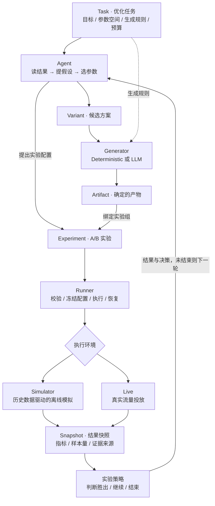
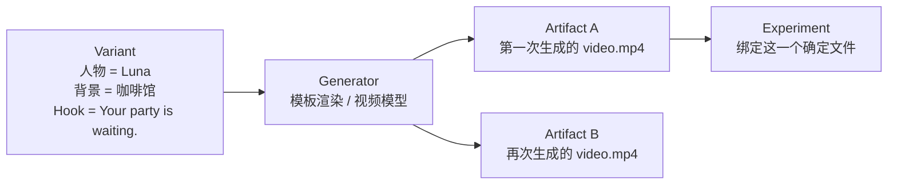
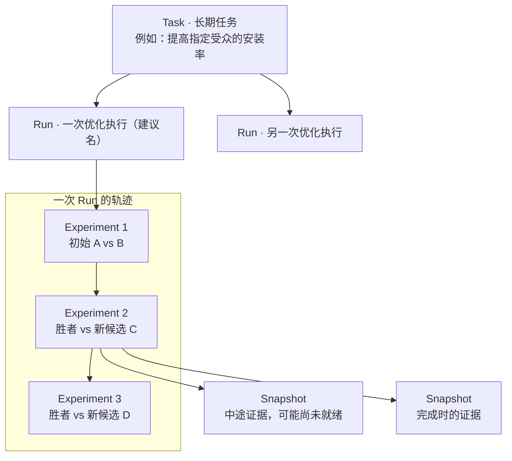
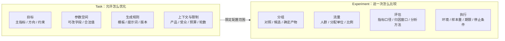
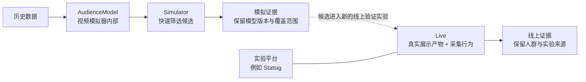
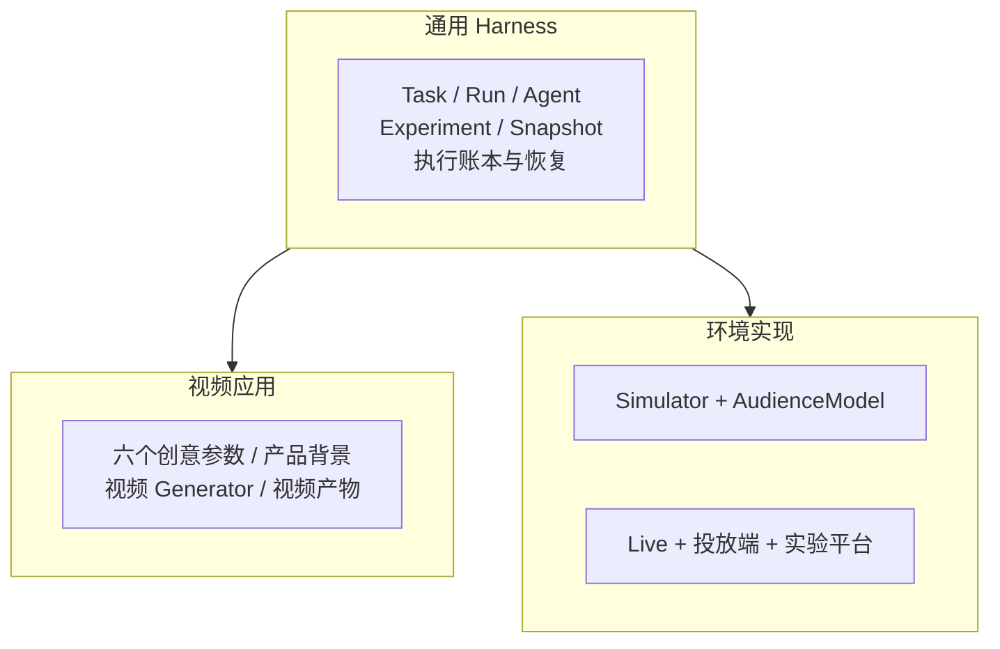

# 通用优化 Harness · 讨论稿

围绕一个目标，让 Agent 基于实验反馈持续提出更好的方案。**视频是第一个应用。**

> 命名与边界尚未批准，本文不代表已实现协议；现有定义见 [primitives.md](./primitives.md)。

## 1. 整个系统如何运转

**Agent 提方案；Generator 生产；Runner 执行；实验策略按固定标准判断。** 首轮可以直接使用预先准备的候选。

## 2. 方案与产物为什么分开

同一参数可能生成不同内容。**Variant 是输入方案，Artifact 是实际被测试的产物**；投放时不重新生成。保存产物及生成规则、版本等记录。

## 3. 任务、运行与实验的关系

采用你批注中的短名称 **Task / Experiment / Snapshot**；`OptimizationRun` 暂建议简化为 **Run**，待确认。每次 Run 固定任务配置版本。

## 4. 配置分别归谁

Agent 在允许范围内配置实验，Runner 校验后冻结。**看到结果后不修改本轮评判标准。**

## 5. Simulator 与 Live 的边界

- 当前模拟器只看视频参数，不看视频内容，无法区分同参数下的两个生成文件。
- 模拟提升需要线上验证；两类证据分开记录。
- `static` 是否指 Statsig 待确认；Statsig 集成之外仍需接入真实投放端。

## 6. 第一版改到哪里

第一版保留 **双组 A/B、固定样本量、一个主指标**。保持历史记录可读、执行可恢复；第二个实际应用出现后再扩展抽象。

## 7. 需要一起定的几件事

| 待定项 | 当前建议 |
| --- | --- |
| 系统定位 | Agent 优化 Harness |
| 单次优化执行的名字 | Run，替代草案中的 OptimizationRun |
| 输入与产物 | Variant → Generator → Artifact |
| Agent 能改什么 | 参数与允许范围内的实验配置；本次 Run 的生成规则固定 |
| 一个实验组测试什么 | 一个确定的 Variant + Artifact |
| 环境名称与平台 | Simulator / Live；确认 static 是否为 Statsig |
| 从模拟进入线上 | 新建验证实验；自动切换与无人审核投放策略待定，暂保留现有审核行为 |

确认后再修改实现，并同步更新领域原语清单。
